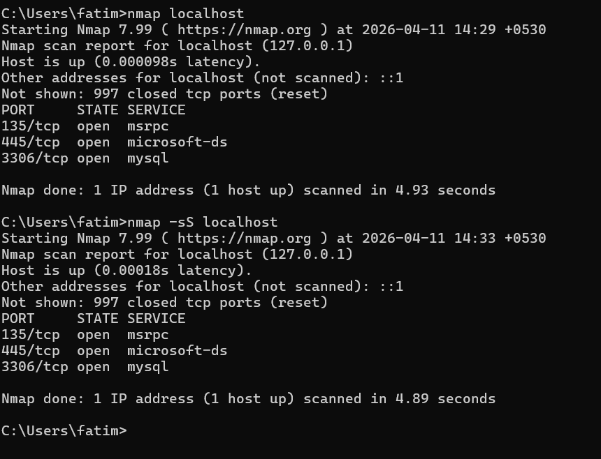
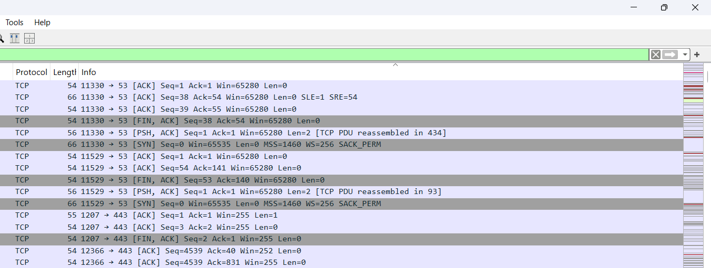
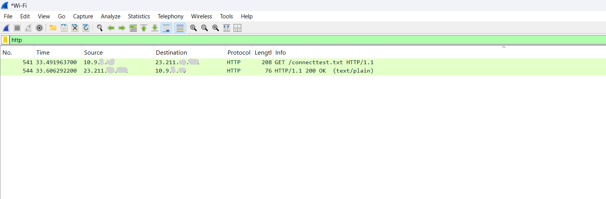

# Network-Scanning-Traffic-Analysis (using Nmap And wiresharks)
cybersecurity project -1 

In this porject i came to learn about the way that how we uses nmap and wireshark to scan and see different ports , identify and understand the communications protocol and detect possible vulnerability that may occur.

OBJECTIVE OF THIS PROJECT :-
To analyze network behavior by scanning open ports and capturing live traffic to understand communication protocols and potential security risks.

## 🛠️ Tools Used
- Nmap (Network Scanning)
- Wireshark (Packet Analysis)

---

## 🔍 Methodology

### 1. Network Scanning
- Performed a scan on the local system using Nmap
- Identified open ports and associated services

### 2. Traffic Capture
- Captured live network traffic using Wireshark
- Generated traffic through web browsing activity

### 3. Traffic Analysis
- Applied filters such as:
  - DNS (Domain resolution)
  - TCP (Connection-based communication)
  - HTTP (Unencrypted web traffic)
- Inspected packet-level details such as GET requests and host information

---

## 📊 Key Findings

### 🔓 Open Ports Identified
- **135 (MSRPC)** – Used for Windows services communication
- **445 (SMB)** – Used for file sharing (potential attack vector)

### 🌐 Protocols Observed
- **TCP** – Primary communication protocol
- **DNS** – Domain name resolution
- **HTTP** – Unencrypted web traffic
- **TLSv1.3** – Secure encrypted communication

---

⚠️ Security Insights
Open ports can act as entry points for attackers
SMB (Port 445) is commonly targeted in cyber attacks
HTTP traffic is not secure and can expose sensitive data
TLS encryption ensures secure communication

### Nmap Scan Result
Shows open ports (135, 445) and running services.

### TCP Traffic Analysis
Displays communication between system and external servers.

### HTTP Packet Inspection
Shows unencrypted request data including GET method and host.

What I Learned
how to check and analyze network traffic
Practical understanding of network scanning
Ability to analyze real-time traffic
Difference between secure and insecure protocols
Basic understanding of network security risks
