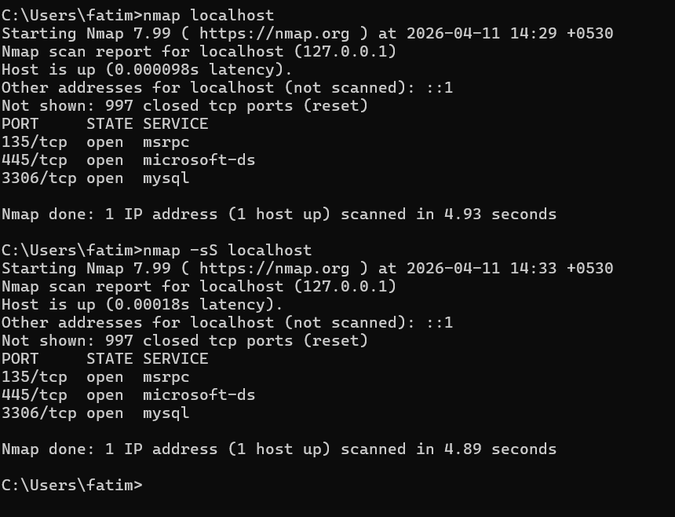
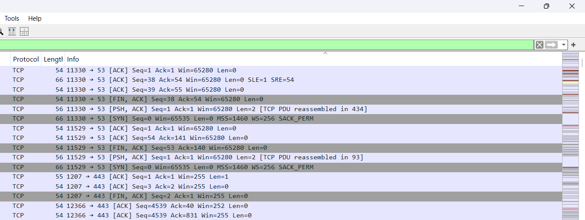
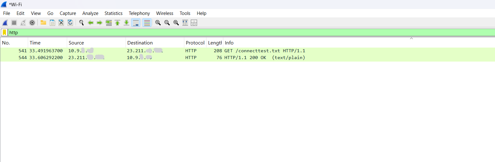

# Network-Scanning-Traffic-Analysis (using Nmap And wiresharks)
cybersecurity project -1 

In this project i came to learn about the way that how we uses nmap and wireshark to scan and see different ports , identify and understand the communications protocol and detect possible vulnerability that may occur.

OBJECTIVE OF THIS PROJECT :-
To analyze network behavior by scanning open ports and capturing live traffic to understand communication protocols and potential security risks.

## Tools Used
- Nmap (Network Scanning)
- Wireshark (Packet Analysis)

---

##  Methodology

### 1. Network Scanning
- Performed a scan on the local system using Nmap
- Identified open ports and associated services

### 2. Traffic Capture
- Captured live network traffic using Wireshark
- Generated traffic through web browsing activity

### 3. Traffic Analysis
- Applied filters such as:
  - DNS (Domain resolution)
  - TCP (Connection-based communication)
  - HTTP (Unencrypted web traffic)
- Inspected packet-level details such as GET requests and host information

---

## Key Findings

###  Open Ports Identified
- **135 (MSRPC)** – Used for Windows services communication
- **445 (SMB)** – Used for file sharing (potential attack vector)

###  Protocols Observed
- **TCP** – Primary communication protocol
- **DNS** – Domain name resolution
- **HTTP** – Unencrypted web traffic
- **TLSv1.3** – Secure encrypted communication

---
Security Insights
Open ports can act as entry points for attackers
SMB (Port 445) is commonly targeted in cyber attacks
HTTP traffic is not secure and can expose sensitive data
TLS encryption ensures secure communication

### Nmap Scan Result
Shows open ports (135, 445) and running services.

### TCP Traffic Analysis
Displays communication between system and external servers.

### HTTP Packet Inspection
Shows unencrypted request data including GET method and host.

### Real-World Applications & Usefulness

- Network Security Monitoring

Security teams can use tools like Nmap to discover devices, open ports, and running services within a network. This helps identify unnecessary or exposed services that could increase security risks.

- Vulnerability Identification

Open ports and exposed services can be investigated to determine whether they are properly configured and whether they have known security vulnerabilities.

- Incident Detection

Wireshark can help security professionals inspect network packets and identify unusual connections, unexpected traffic, or suspicious communication that may indicate a security incident.

- Protocol Analysis

Analyzing protocols such as DNS, TCP, HTTP, and TLS helps security professionals understand how systems communicate and how data moves across a network.

- Data Security

Analyzing HTTP traffic demonstrates the risks of transmitting information without encryption, while TLS traffic demonstrates how encryption helps protect data during transmission.

- Network Troubleshooting

Nmap and Wireshark are also useful for troubleshooting network connectivity issues, identifying communication problems, and understanding how devices interact within a network.

### Overall Usefulness
- Network Security
- Security Operations Center (SOC)
- Vulnerability Assessment
- Penetration Testing
- Incident Response
- Network Administration

## What I Learned
- How to check and analyze network traffic  
- Practical understanding of network scanning  
- Ability to analyze real-time traffic

